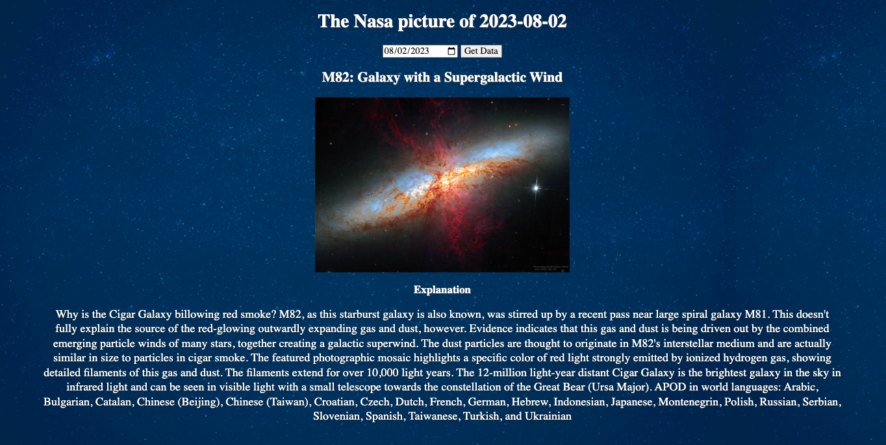

# Nasa api Website
This is a website I buit for the Broward County stargazer society. It uses Nasa's APOD api to get images and supports videos as well. 
**Link to project:** http://recruiters-love-seeing-live-demos.com/

## How It's Made:
**Tech used:** HTML, CSS, JavaScript

After getting data from NASA in a JSON format I was able to take all the relevant information and append it to the DOM using javascrit event listeners. With CSS i was able to make the website a bit more visually appealing than the standard NASA site. My goal was to give the website a spacial presence but not make it too pronounced so that it would look good with whatever image came back from. 

## Lessons Learned:

I learned to read in between the lines and that all you get back from the API may be useful. This API is called "Astronomy picture of the day" yet it will sometimes return a video. I learned to be more thourough and look at all the information that I was receiving back. The API returned a media type of image, the fact that this was specified made me question whether there were other media types. 

